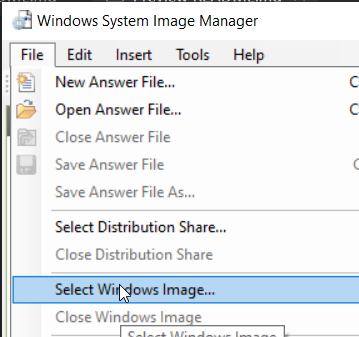

# Windows Imaging Script

## Usage

```powershell
.\Build-CustomImage.ps1 -MountPath C:\Mount -SourceImagePath H:\ -DesiredVersionName "Windows 11 Professional"
```

## Guide

1. Download the Windows installation image:
    - [Microsoft](https://www.microsoft.com/en-gb/software-download/)
    - [Massgrave](https://massgrave.dev/genuine-installation-media)
2. Mount the installation image:\
    
3. Pick the desired version using [`Get-WindowsImage`](https://learn.microsoft.com/en-us/powershell/module/dism/get-windowsimage?view=windowsserver2025-ps):
    ```powershell
    Get-WindowsImage -ImagePath H:\sources\install.wim
    ```
4. Find the ID for the Latest Cumulative Update at:
    - [Windows 11](https://support.microsoft.com/en-us/topic/windows-11-version-24h2-update-history-0929c747-1815-4543-8461-0160d16f15e5)
    - [Windows 10](https://support.microsoft.com/en-us/topic/windows-10-update-history-8127c2c6-6edf-4fdf-8b9f-0f7be1ef3562)\
    
5. Find the ID for the Service Stack Update at:\
    
6. Download Updates and save at [.\Updates](../Updates/) from:
    - [Microsoft Update Catalog](https://www.catalog.update.microsoft.com/Search.aspx)
7. Export current Windows drivers using [`Export-WindowsDriver`](https://learn.microsoft.com/en-us/powershell/module/dism/export-windowsdriver?view=windowsserver2025-ps):
    ```powershell
    Export-WindowsDriver -Online -Destination .\Drivers
    ```
8. Download Packages (e.g. WinGet) at [.\Packages](../Packages/):
    - [Microsoft.DesktopAppInstaller_License.xml](https://github.com/microsoft/winget-cli/releases/latest/download/7fdfd40ea2dc40deab85b69983e1d873_License1.xml)
    - [Microsoft.DesktopAppInstaller.msix](https://github.com/microsoft/winget-cli/releases/latest/download/Microsoft.DesktopAppInstaller_8wekyb3d8bbwe.msixbundle)
    - [DesktopAppInstaller_Dependencies](https://github.com/microsoft/winget-cli/releases/latest/download/DesktopAppInstaller_Dependencies.zip)
9. Get Capabilities list using [Get-WindowsCapability](https://learn.microsoft.com/en-us/powershell/module/dism/get-windowscapability?view=windowsserver2025-ps):
    ```powershell
    Get-WindowsCapability -Path C:\Mount
    ```
    - Fill [.\Configs\enabled-capacities.txt](../Configs/enabled-capacities.txt) and [.\Configs\disabled-capacities.txt](../Configs/disabled-capacities.txt).
10. Get Features list using [Get-WindowsOptionalFeature](https://learn.microsoft.com/en-us/powershell/module/dism/get-windowsoptionalfeature?view=windowsserver2025-ps):
    ```powershell
    Get-WindowsOptionalFeature -Path C:\Mount
    ```
    - Fill [.\Configs\enabled-features.txt](../Configs/enabled-features.txt) and [.\Configs\disabled-features.txt](../Configs/disabled-features.txt).
11. Download and Install [Windows Assessment and Deployment Kit](https://learn.microsoft.com/en-us/windows-hardware/get-started/adk-install)
    - Pick the `Deployment Tools`\
    
12. Open Up `Windows System Image Manager` and open the `H:\sources\install.wim` file.\
    
13. Create and configure the `AnswerFile` and save at [.\Configs\unattend.xml](../Configs/unattend.xml).
14. Run `PowerShell` as `Administrator` and run:
    ```powershell
    .\Build-CustomImage.ps1 -MountPath C:\Mount -SourceImagePath H:\ -DesiredVersionName "Windows 11 Professional"
    ```